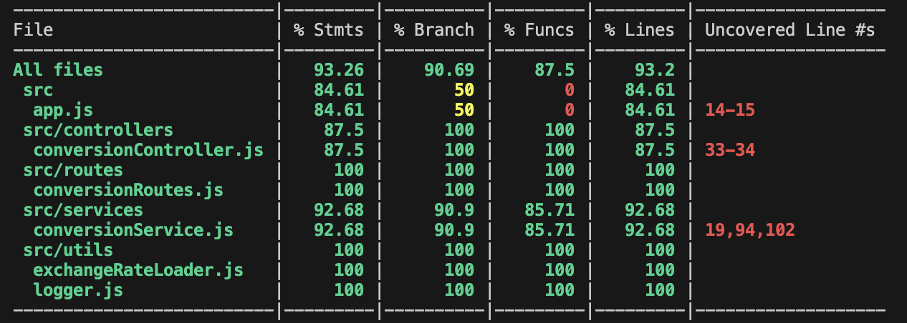

# RideFlag Assignment

---

## Installation

### **1. Clone the Repository**

```sh
git clone https://github.com/btirth/ride-flag-assignment
cd ride-flag-assignment
```

### **2. Install Dependencies**

```sh
npm install
```

### **3. Setup Environment Variables**

Create a `.env` file in the root directory and add the following:

```env
PORT=4000
exchangeRates=./data/exchange_rates.csv
```

### **4. Run the Server**

```sh
npm start
```

The server will start at `http://localhost:4000`.

---

## Running Tests

Run Jest tests using:

```sh
npm test
```



---

## 📁 Project Structure

```
├── .github
│   ├── workflows
│   │   ├── cicd.yml
├── src
│   ├── controllers
│   │   ├── conversionController.js
│   ├── routes
│   │   ├── conversionRoutes.js
│   ├── services
│   │   ├── conversionService.js
│   ├── utils
│   │   ├── exchangeRateLoader.js
│   │   ├── logger.js
│   ├── app.js
├── data
│   ├── exchange_rates.csv
├── tests
│   ├── controllers
│   │   ├── conversionController.test.js
│   ├── services
│   │   ├── conversionService.test.js
│   ├── utils
│   │   ├── exchangeRateLoader.test.js
├── .env
├── package.json
├── README.md
```
